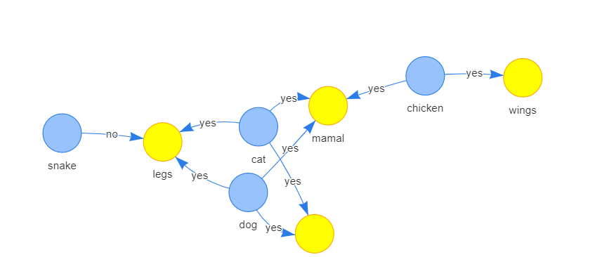

# Introduction

*swiplr* is an R wrapper for Prolog. I use it only with SWI-Prolog but
you may succeed to use it with other versions of Prolog (not tested).

# Install

*swiplr* is using your SWI-Prolog binary. You shall install it first on your 
operating system. Use the command below for a debian (or ubuntu) based linux. 
For other operating systems go to [swi-prolog download page](https://www.swi-prolog.org/download/stable).

```{bash}
sudo apt-get install -qq -y swi-prolog
```

Then you can install the package from github using devtools. If you do not have devtools,
install it first with `install.packages("devtools")`

```{r}
devtools::install_github("https://github.com/battmanux/swiplr.git")
```


Congratulations! You are ready to use *swiplr*.


```{r setup}
library(swiplr)
```

In case you would like to use another Prolog binary, you can force to binary path with `options(swipl_binary = "prolog")`. *swipl_binary* can also be an absolute path to your own version of swipl. For instance */usr/local/bin/swipl*

\pagebreak

# Simple usage

## Return booleans

```{prolog}

bar.

?- bar.
```

```{prolog}

foo(bar).

?- foo(foo).
```

## Return data.frame

```{prolog}
male(joe).
male(bob).
female(olivia).
female(mia).

parent(joe, bob).
parent(joe, olivia).
parent(mia, bob).
parent(mia, olivia).


children(X, Y)   :- parent(X, Y).
sibling(X1, X2, P)  :- parent(X1, P), parent(X2, P), dif(X1,X2).

?- sibling(SIBLING_1, SIBLING_2, PARENT)
```


## Hiding columns

You can add _ at the end of a variable to remove it from result table.

```{prolog}

male(joe).
male(bob).
female(olivia).
female(mia).

parent(joe, bob).
parent(joe, olivia).
parent(mia, bob).
parent(mia, olivia).


children(X, Y)   :- parent(X, Y).
sibling(X1, X2, P)  :- parent(X1, P), parent(X2, P), dif(X1,X2).

?- sibling(SIBLING_1, SIBLING_2, PARENT_), female(PARENT_)
```

By default we return anly the 10 first rows. Use `maxnsols` to increase the table side.

__we set the maxnsols=20 variable to this chunk header__
```{prolog, maxnsols=20}

foo(X) :- member(X, [1,2,3,4,5,6,7,8,9,10,11,12]).

?- foo(Number)
```


\pagebreak
# Exchange data with R

## Lets define a few variables

```{r}

some_name <- "john"

value_list <- paste0("bar_", 1:3)

named_list <- list(
  var1 = list(
    field1 = "sömé àçênts", 
  var2 = "bar0")
)

some_table <- r_to_pro(iris[sample(1:150, 4),])

```

## We can use them from prolog

One can use  `whisker::whisker.render` syntax. By default whisker applies html
escaping on the generated text. To prevent this use {{{variable}}} (triple) in stead of {{variable}}.

__we give the name `simple_foo_chunk` to this chunk so that we can use its output in R__
```{prolog simple_foo_chunk}

% Inject the content of R some_name variable
foo({{{ some_name }}}).


?- foo(BAR).
```

We can also inject more complex data structures

```{prolog}

foo('{{{ named_list$var1$field1 }}}').

% Iterates through the list of values in R value_list vector
{{{#value_list}}}
  foo({{{.}}}).
{{{/value_list}}}

% Iterate through a table (list of rows)
% use r_to_pro() to convert data.frame to the right format
{{{#some_table}}}
  some_table({{{Species}}},{{{Sepal_Length}}},{{{Sepal_Width}}}).
{{{/some_table}}}

?- foo(FOO)
?- some_table(Species, Sepal_Length, Sepal_Width)
```

## We can use prolog results from R

And then get back the last chunk values in R with the `prolog_output` variable.

```{r}

prolog_output$result_1

```

If we give a label or a name to a Prolog chunk, its output will be saved into 
an R variable with the same same:

```{r}

str(simple_foo_chunk)

```
## Use prolog ouside of Rmd files

You may want to directly call prolog from an R script (maybe shiny). 
You can achieve this by calling `pl_eval`:

__This is an R chunk__
```{r}

my_value <- "open_bar"

my_result <- pl_eval(
  data = .GlobalEnv,
  body = "foo(bar1). foo(bar2). foo({{ my_value }}).", 
  query = "foo(Foo)")

print(my_result)
```


\pagebreak
# Build a database over several chunks

This `database` describe some predicates:
__we set the label=database variable to this chunk header__
```{prolog label=database}

foo(bar_from_database_chunk_1).
foo(bar_from_database_chunk_2).

?- foo(BAR)
```

This chunk load the database chunk, add facts and query it. Note that with RStudio you can use
chunk names completion that appears after typing the $ character.

Query at the end of the chunk is optional. You can define a chunk of data without
it.

__we set the label=extended variable to this chunk header__
```{prolog, extended}

{{{ .swiplr_chunks$database }}}

foo(bar_from_extended_chunk_3).

```

Chunks with eval=FALSE will be added to the chunk list but results will not be 
displayed.

__we set the label=extended_bis variable to this chunk header__
```{prolog, extended_bis, eval=FALSE}

{{{ .swiplr_chunks$extended }}}

foo(bar_from_extended_chunk_4).

?- foo(X).
```

Lets query the entire database. Note that you can rerun intermediate chunks without rerunning the entire document. 

```{prolog}

{{{ .swiplr_chunks$extended_bis }}}

foo(bar_from_unnamed_chunk_5).

?- foo(X).
```

However you must evaluate a prolog named database chunk after change so that 
*swiplr* knows its content.


\pagebreak
# Advanced result formating

It is often needed to look at results as sparse table or connected graph.
We have here two experimental ways of doing it.

## Lets consider a simple database


```{prolog sparse_table}

cell(cat,legs,yes).
cell(cat,tail,yes).
cell(dog,legs,yes).
cell(dog,tail,yes).
cell(chicken,wings,yes).
cell(snake,legs,no).
cell(X,mamal,yes) :- member(X,[cat,dog,chicken]).

```

## As a sparse table

Whenever you would like to see results with one entity per line and attributes in 
columns, you can build a query with the three following keywords: ENTITY, COLUMN_HEADER, CELL.

Each result produces one cell in the table:
- ENTITY:        will be the row label
- COLUMN_HEADER: will be the column header
- CELL:          will be the content of the cell.

Make sure you have `tidyr` package installed. 

```{r}

table_query(
  body = .swiplr_chunks$sparse_table, 
  query = "cell(ENTITY, COLUMN_HEADER, CELL)")


```


## As a chart

You way also need to represent results as interconections in a graph.
- FROM:   name of the source node
- TO:     name of the target node
- LINK:   name of the link

Each result will be displayed as an oriented link in the graph 

Make sure you have `visNetwork` package installed. 

```{r}

plot_query(
  body = .swiplr_chunks$sparse_table, 
  query = "cell(FROM, TO, LINK)")


```

This produces an interactive HTML chart like this:



\pagebreak
# Degraded modes

## Infinite loop

In case you define an infinit-loop in Prolog, or your query takes too long to process,
there is a time limit protection of 10s. You can change the duration with *timeout*.
Remove *eval=F* to try.

```{prolog, timeout=1, eval=F}

s1(A) :- s2(A).
s2(A) :- s1(A).

?- s1(X)
```
## Verbose mode

In case you do not get the expected result, you can activate the *verbose* mode.

Remove *eval=F* to try.

```{prolog, verbose=T, eval=F}

foo(ee)
bar(ee,a) :- foo(cc).

?- bar(A, B)
```

You will get the Prolog source file and Prolog output in R Console output. 
*swiplr* will load the source file in swi-prolog and add several main_[action] predicates.

```{cat, eval=FALSE}
---------------
SOURCE FILE:
---------------

foo(ee)
bar(ee,a) :- foo(cc).

[...]


---------------
PROLOG OUTPUT:
---------------
ERROR: /home/rstudio/saved_data/Packages/swiplr/inst/filepl11a411911184.pl:2:8: Syntax error: Operator expected
ERROR: -g main_print_tl: setup_call_catcher_cleanup/4: Undefined procedure: bar/2
ERROR:   However, there are definitions for:
ERROR:         var/1 
---------------
```


\pagebreak
# Advances features

## Check query duration

Use *mode="duration"*. You will get the result in milliseconds.

```{prolog, mode="duration", verbose=T}

loop([], 0).

loop([[a,D]|L], C) :-
  C>0,
  D is C-1,
  loop(L, D).

?- loop(L, 100000)
```

## Profile

Use *mode="profile"*. You will get the result in milliseconds.

```{prolog, mode="profile"}

loop([], 0).

loop([[a,D]|L], C) :-
  C>0,
  D is C-1,
  loop(L, D).

?- loop(L, 10)

```


## trace

You can trace calls and activate verbose mode. Doing so you will see output in Console.

```{prolog, verbose=T}

foo(one).
bar(two).
bar(X) :- foo(X).

:- trace(bar/1).
:- trace(foo/1).

?- bar(X).
```


## Strange cases

```{prolog}

foo(no_space).
foo('with space').
foo([this, is, a, list]).
foo([this, is, a, 'list with space']).
foo([this, is, a, [list, [of, list]]]).
foo(this(has(pred))).
foo(this(has('pred with space'))).
foo('even , } { } ) or ( works in atom').

?- foo(X)
```


## known limitations

```{prolog, verbose=T}

should_we_calculate(case1, 1+1).
should_we_calculate(case2, 2*5).
should_we_calculate(case3, 2/5).
should_we_calculate(case4, 2-5).
should_we_calculate(but5, 5**2).
should_we_calculate(but6, sqrt(9)).
should_we_calculate(bug, c(9, 3)). 
% this is due to collision with R c() function

?- should_we_calculate(CASE, RESULT)
```


## Build an app

```{prolog}

run :- writeln('hello world').

?- qsave_program('app.bin', [goal(run), stand_alone(true), foreign(save)]).
```

```{bash}

./app.bin

```

